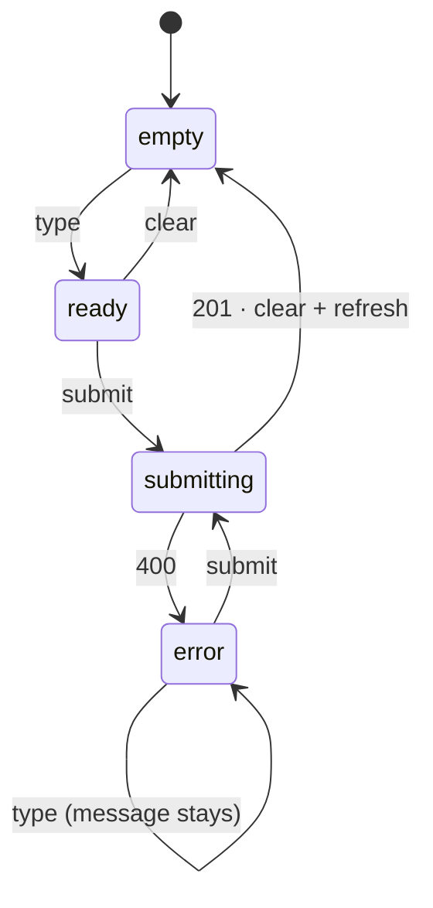

# Progress selection

## Why
Signed-in learners need to choose and persist their current level without losing the server-held progress state between page refreshes.

## Where it lives
- `apps/web/components/ProgressForm.tsx`
- `apps/web/app/page.tsx`
- `apps/web/app/api/progress/`
- `packages/domain/src/queries/progress.ts`

## Behavior
The home page renders a progress form for signed-in users. The form starts empty, becomes ready when a level is selected, and submits the selected level to `POST /api/progress`.

The API derives the signed-in user, validates `currentLevelId`, confirms the level exists, and stores the value on that user's record. A successful write returns `201` and the saved progress. `GET /api/progress` returns the signed-in user's saved progress. Missing or unknown resources return `404`; unauthenticated requests return `401`.

The form clears and refreshes the server-rendered page after a successful `201`. A `400` response moves the form to error state and preserves the message while the learner edits and retries. Clear returns the form to empty state.

## Examples

| State / input | Behavior |
|---|---|
| Select an existing level | The form submits and the user's current level is saved. |
| Submit an unknown level id | The API returns `404` and leaves saved progress unchanged. |
| No signed-in user | The API returns `401` and the page redirects to sign-in. |
| Successful save | The form clears and the page refreshes from server state. |

## Verify
Run `pnpm test`, `pnpm typecheck`, and `pnpm build`. On the home page, select a level, save it, refresh, and confirm the saved-progress message remains. Submit an invalid level through the API and confirm it returns `404`.

## Constraints & decisions
- Progress is stored on the signed-in user's `currentLevelId`; the browser does not own the durable state.
- The form uses the existing levels returned by the server and does not create levels.
- All progress queries derive identity from the session; clients never submit a user id.

## Out of scope
Completion rules, submission history, and level content remain covered by the existing web and submission behavior.